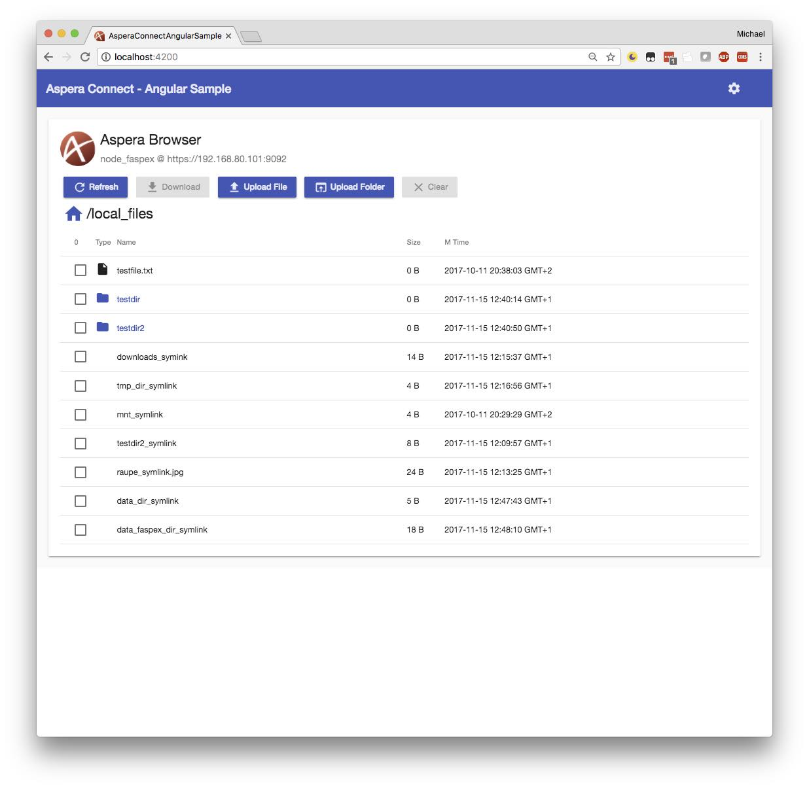
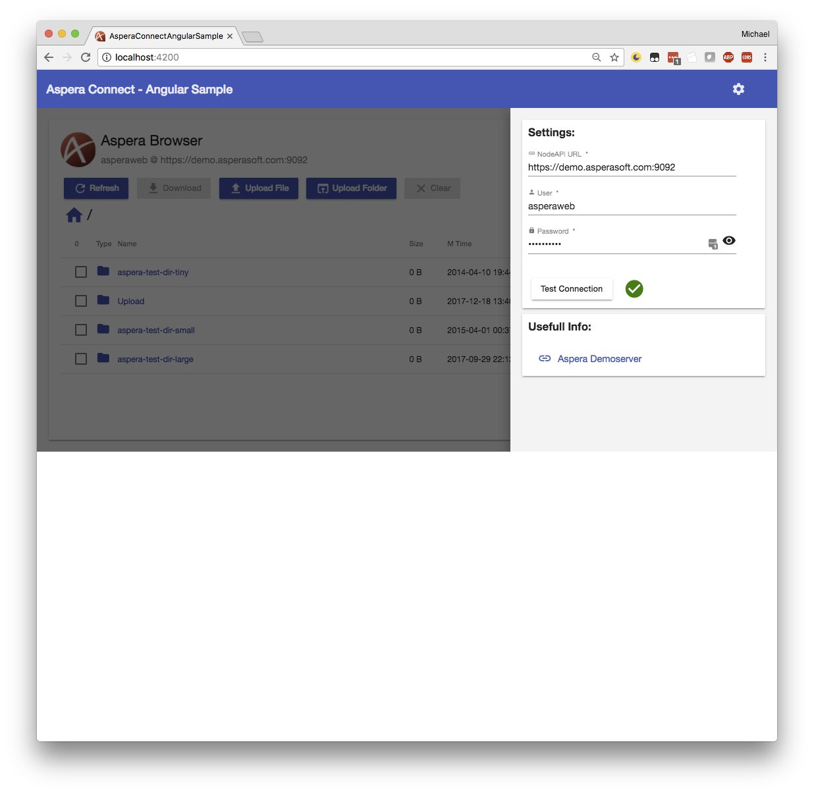

## Aspera Connect -  Angular Sample 


Angular App using Aspera Connect API and Node API, for file and folder upload+download.
UI using Angular Material components.

See the [Architecture Overview](Architecture.md) for information how it works. 

### See it live:
My sample is deployed on IBM Cloud:
http://asperabrowser.mybluemix.net

### run & test local
(Prereq: Node.js,npm and angular cli installed)

Run `ng s` to start the Angular Live Development Server

### Build & deploy to IBM Cloud
(Prereq: as above + cloud foundry cli installed and IBM Bluemix account )

Run `ng build -aot -prod` to build.  The `dist/` directory contains the static WebApp. 
To deploy, copy everything in `dist/*` directory to public dir on the webserver.

Deployment to IBM Cloud cf-nginx (login to your right Bluemix cf space first):   
```
ng build -prod
cd dist
touch Staticfile
cf p myAsperaBrowser -m 64M
cd ..
``` 

### Todo / planned 
- npm package
- Docs & more Docs
- Transfer Management in UI 
- devops integration (travis / greenkeeper)

### Changelog
- 20171206 - first simple download 
- 20171212 - nodeAPI browse sample 
- 20171214 - upload sample  
- 20171216 - tokenauth  
- 20171217 - UI layout  & settings panel
- 20171218 - delete file & some docu 
- 20171218 - breadcrumb folder navi
- 20171219 - table sort filter paginator 
- 20171220 - tokenauth toggle / New Folder / delete confirmation
- 20171227 - settings changed validation
- 20171231 - update angular / deploy as node.js
- 20180105 - node.js middleware (first & simple version)
- 20180108 - some simple error handling
- 20180115 - simple config files 

### Screenshots 

##### Browse Directory:


##### Settings panel:



---

This project was generated with [Angular CLI](https://github.com/angular/angular-cli) 
