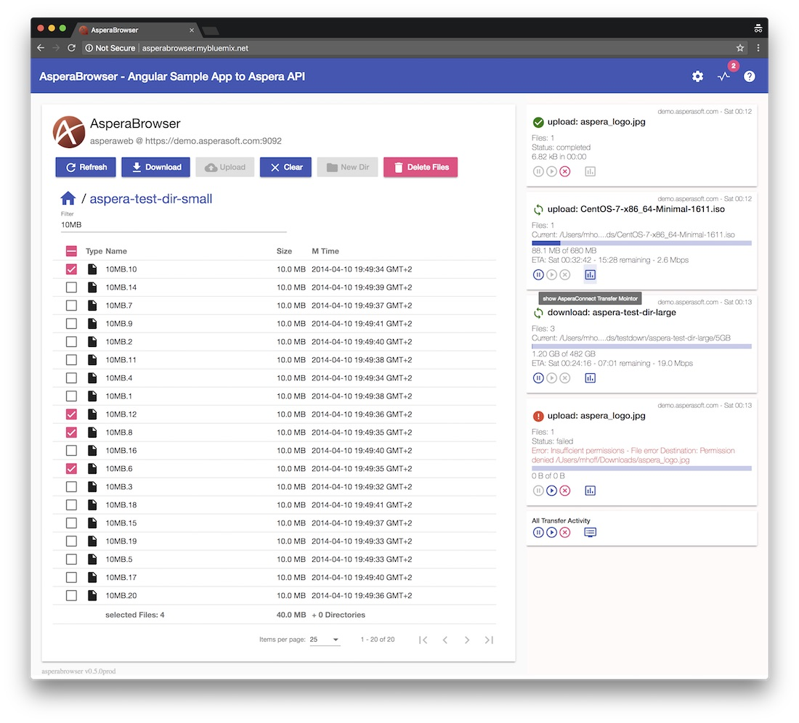

## AsperaBrowser -  Angular Sample App to Aspera Connect & Node API  

Angular App using Aspera Connect API and Node API for file and folder upload & download.
UI using Angular Material components.

(:exclamation: At the moment this is just a personal project for me to get familiar with the Aspera APIs and technology, and not an "official" open source project from IBM / Aspera)

### See it live:
A sample is deployed on IBM Cloud:
[asperabrowser.mybluemix.net](https://asperabrowser.mybluemix.net)
(This sample is preconfigured with a login to the Aspera Demoserver. Just click login)

### use it on you own system / node.js server
AsperaBrowser can be provided by a node.js web server. See the [node.js-server directory](node.js-server) to use/install it on your own system.

### Build the AsperaBrowser Angular
This directory contains the sources for the Angular App. It can be deployed as static SPA (see [Installation Guide](doc/Installation_Guide.md))
To build the AsperaBrowser Angular App run `npm run build`.  This will create a new build in the `node.js-server/webapp/` directory that contains the static WebApp.   

[Architecture Overview](doc/Architecture.md) provides information on the application components and the used APIs. 

### Todo / planned / ideas 
- Docs & more Docs
- setup on windows  
- Transfer Management in UI
- start transfer error Handling
- Docker Image
- own user / authorization integration for node.js server 
- sharing via access keys  (as suggested by Laurent)  

### Screenshots 

##### Browse Directory:

##### Settings panel:

---

This project was generated with [Angular CLI](https://github.com/angular/angular-cli) 
