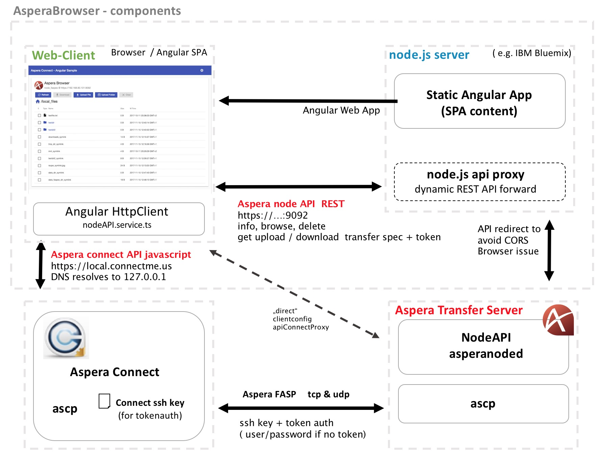

## AsperaBrowser -  Architecture  

### component diagram
 

Aspera NodeAPI is a feature of Aspera Enterprise Server that provides a RESTful interface for control of the transfer server environment.
The NodeAPI is accessed by basic https auth from the web client.  
**Todo:** At the moment this is implemented as a direct connect from client side Angular App to the Aspera Transfer Server. Because of Cross-Origin Resource Sharing (CORS) violation in the Browser there is a need to implement a REST API redirect to serve the NodeAPI also from the Web-server that provides the Angular App) 

#### Download flow:
* web client logs in  (Aspera node user + basic auth )
* browse directory - select files (NodeAPI /browse)
* web app requests a transfer spec for selected files  (NodeAPI /download_setup) 
* web app call connect with this transfer spec (ConnectAPI startTransfer) 
* connect client connects to transfer server  
    * if related system user requires token auth connect authorize with ssh key + transfer token
    * else it ask for system userid and password 
* ascp fasp transfer starts on UDP  

#### Documentation for the used Aspera APIs:  
- [Aspera Connect Client API](https://developer.asperasoft.com/web/connect-client/all) 
- [Aspera Node API (RESTful)](https://developer.asperasoft.com/web/node/index)

(Aspera Developer Network subscription needed) 

